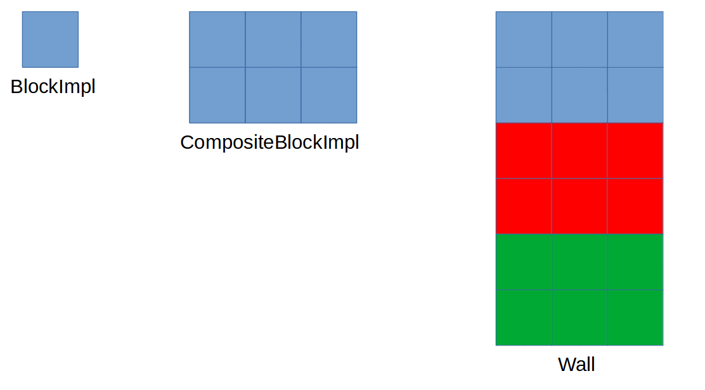

## Blocks Task
Recruitment task using Java

### Task info
Task content consists of three interfaces:
* Block
* CompositeBlock
* Structure

The main goal of the task was to analyse and implement three
methods included in given interfaces in class named Wall. 

### Main assumptions:
* Block is elementary unit of the structure
* Composite block is intermediate unit of structure consisting of blocks
* Wall is target structure consisting of composite blocks

### Additional assumptions:
* All blocks in a single composite block must be of the same color and material
* Color and material of single block must be specified
* main class was made only for testing purposes

### Implementation
* **public Optional<Block> findBlockByColor(String color)** method takes color of
  block and returns example block object of this color
* **List<Block> findBlocksByMaterial(String material)** method takes material of
  block and returns an arraylist of all blocks objects made of given material
* **public int count()** method returns number of elementary units (Block objects)
  from which the structure (Wall object) is build
* **public void addBlock(Block block)** method takes block object and adds it to
  composite block object

